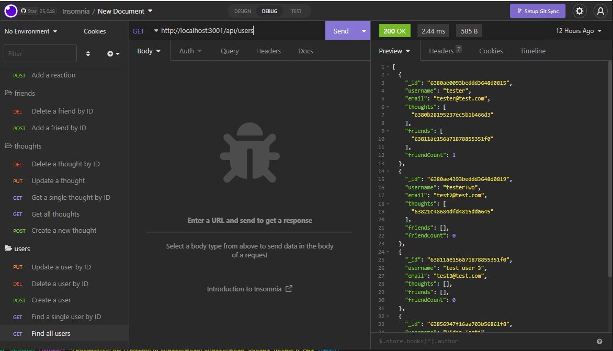

# SOCIAL NETWORK API

This is a fully functional back end social network api, implemented using  
MVC and mongoDB/NoSQL.

[Video of app execution](https://drive.google.com/file/d/10JpUT5WiqgB98Q7bQUug4lNn0ufcOBKV/view)

## Description

This application allows the user/developer to query specific routes  
to pull back information about users, their thoughts, friends, and reactions.

### Installing

To install dependencies, simply run the command 'npm i'.

### Executing program

To execute the program first, open either insomnia or postman. You can then  
start the server with 'npm start', assuming you have mongoDB downloaded. Next,  
you can query the routes commented in the routing folder for specific endpoints.  
There is no seeding in the project so you will need to make your own DB.

### Testing

No testing currently available.

## Authors

Dylan Crowley:

[Github](https://github.com/dcrowdev)  
[Twitter](https://twitter.com/dcrowdev)  
[LinkedIn](https://www.linkedin.com/in/dylan-crowley-3974b8252/)  
dcrowdev1025@gmail.com

## License

This project is licensed under the MIT license.

## Acknowledgments

UCF Fullstack bootcamp!
